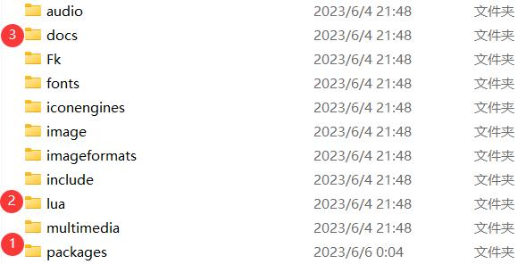
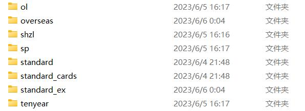
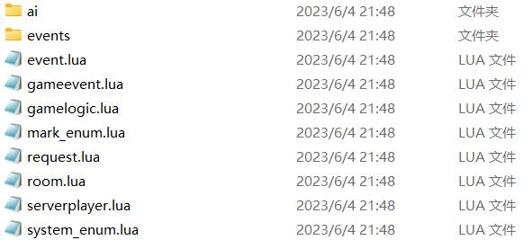
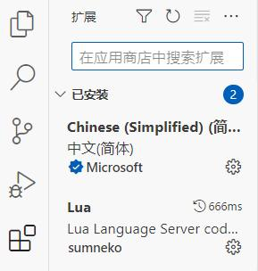
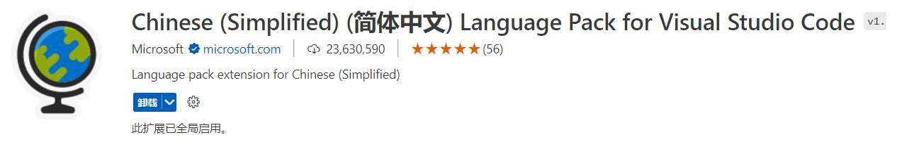
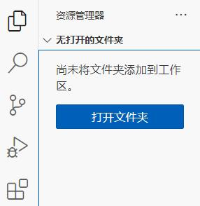
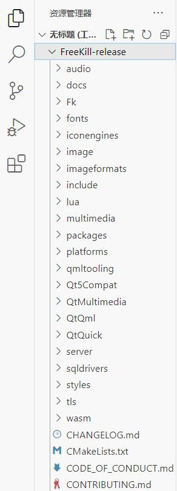

.. SPDX-License-Identifier: GFDL-1.3-or-later

开发环境准备
===================

熟悉新月杀
---------------

在制作扩展前，我们先需要熟悉一下新月杀的文件结构。

打开新月杀文件目录，和制作扩展相关的主要有packages、lua和docs这三个文件。

   新月杀的目录结构

1. packages文件夹是储存所有游戏卡牌扩展和武将扩展的位置。新月杀的本体只包含
standard和standard_cards两个包，它们属于核心扩展，也就是三国杀的标准包
和标准牌堆包。

如果你进行过服务器联机的话，会自动同步服务器上的所有拓展包，例如shzl
（神话再临）。在新月杀中，扩展包拥有在线安装/在线更新的功能，
这种功能都是依托于git进行的，因此如果你打算将自己的扩展包发布出去的话，
就需要为其创建git仓库，并托管到git托管网站去。
如何进行扩展包发布和git托管参见其他教程。

   packages/下存放着拓展包

2. lua文件夹是新月杀运行规则的核心。我们以lua文件夹下的server文件为例：

   server文件夹

server文件夹中包含许多在客户端执行文件。例如，events文件夹中是三国杀各类“事件”
的执行规则，它定义着诸如使用牌事件的流程、扣减体力事件各种时机的先后顺序，
这些流程是我们按照规则集现有结算规则严格制定的。

虽然lua文件夹神通广大，但并非是我们扩展包开发需要修改的内容。
我们需要熟悉其中游戏结算的逻辑，在其中查阅要利用的函数，
寻找调试修正bug的方法。在没有思路实现某个功能时，翻翻lua文件夹总能有新发现^_^。

3. docs文件夹中是Notify编写的新月杀开发教程，适合有较高编程基础的大佬查看。

准备代码编辑器
--------------------

新月杀扩展的开发完全使用Lua语言。采用Lua不需要编译，语法简单易懂，
外加太阳神三国杀的一些渊源，使用Lua完全符合我们自由、开放、可扩展的diy平台理念。

尽管使用记事本就能直接编辑Lua文件，但工欲善其事必先利其器，
用一款好的代码编辑器对于提高编程效率、查漏补缺是很有帮助的。
出于易用性和免费的考虑，我们推荐用VSCode进行编写（百度搜索下载即可）。

   vscode

VSCode提供的插件能为开发提供很大便利。点击侧边栏，选择第五项“扩展”选项卡，
直接搜索插件名字安装即可。

   插件面板

1. 中文翻译包

   安装中文翻译插件吧！

难道有人看英文比中文更顺眼？

2. Lua

   安装Lua插件吧！

Lua插件提供了强大的代码提示、补齐、纠错、注释功能，妈妈再也不用担心我打错字啦^_^。

在VSCode中部署工作区
-------------------------

为了方便在文件间进行切换，以及全局搜索相关内容，我们先将游戏目录部署到工作区。
点击VSCode的侧边栏，选择第一项“资源管理器”选项卡：

   资源管理器面板

点击“打开文件夹”，选择我们用来开发的游戏目录（FreeKill-release文件夹）。
注意，因为我们开发、调试都是在本地进行的，还没有上传至服务器，所以最好是复制一份
游戏本体，用来玩的和用来开发的区分开，不然我们修改过文件的游戏是不能连接服务器的。

资源管理器中显示出文件目录就部署好啦。

   
   部署完成工作区后，应该像这样
