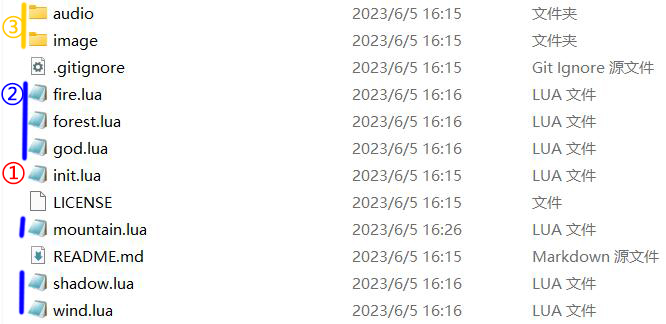
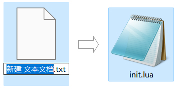
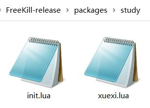
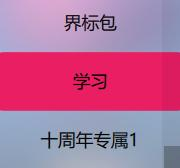
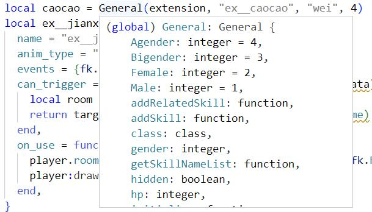
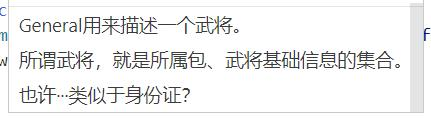
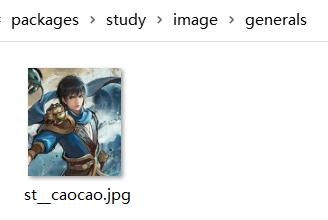
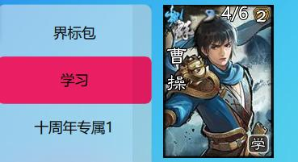

.. SPDX-License-Identifier: GFDL-1.3-or-later

Hello world! 创建扩展
=======================

扩展包的内容
-------------

如在上一章所述，新月杀的游戏扩展文件全部位于packages文件夹。
我们先看看游戏中现有的扩展是怎样的。打开packages/shzl：

   拓展包shzl的内部文件

1. init.lua

  init.lua文件是扩展包的核心，扩展中所有的lua文件都需要加载到
  init.lua中来。打开shzl的init.lua：

  .. code-block:: lua

      local wind = require "packages/shzl/wind"
      local fire = require "packages/shzl/fire"
      local forest = require "packages/shzl/forest"
      local mountain = require "packages/shzl/mountain"
      local shadow = require "packages/shzl/shadow"
      local god = require "packages/shzl/god"

      return {
        wind,
        fire,
        forest,
        mountain,
        shadow,
        god,
      }

  我们可以看到通过 ``require`` ，对应目录下的wind风、fire火等子扩展包都加载进来了。
  同理，也可以像标准包一样 ``require`` 要用的翻译文件、辅助函数。

  .. hint::

    ``require`` 会将全局变量也加载进来，因此代码中要慎用全局变量。

2. 子扩展包

   一个大的扩展包系列会含有多个小扩展包，例如神话再临的风林火山，
   一将成名的2011~2015。子扩展包是游戏中武将一览的划分区间。
   这样做既是为了分类美观、查找方便，也是限制单个lua文件大小。

   .. hint::

     Lua语言规定单个文件至多只能有200个局部变量，
     因此建议一个子扩展包的武将数量不要超过40。

3. audio、image

   顾名思义是存放扩展包语音、图片的文件夹。对于我们的第一个扩展做得简单些，
   只需要了解：audio中的death为武将阵亡语音，skill为技能语音；
   image中的general为武将图片。

4. 其他文件

   包括开源声明、git托管文件等，先不管它们。

创建拓展包
-----------

我们模仿shzl的形式创建一个扩展。首先在packages文件夹下建立一个新文件夹。
老传统，我们的第一个扩展就叫study学习包~

   新建文件夹

然后在study文件夹中创建一个init.lua文件。可以直接从其他包复制，
也可以新建一个txt文本然后改名。用VSCode打开它，修改代码加载子扩展包：

   新建文本文件并改名

.. code-block:: lua

   local xuexi = require "packages/study/xuexi"

   return {
     xuexi,
   }

.. hint::

   1. 以UTF-8无BOM格式编码。
   2. 所有文件尾必须留一个换行符，敲一个回车即可。

再建立一个新的xuexi.lua，修改为：

.. code-block:: lua

   local extension = Package:new("xuexi")
   extension.extensionName = "study"

   Fk:loadTranslationTable{
     ["xuexi"] = "学习",
   }

   return extension

- 1行是创建扩展包，填子扩展包的名字。

- 2行是这个子扩展包所属的大扩展包，它的名字必须为我们文件夹的名字，
  整个大扩展包的图片都是根据这个名字寻找路径的。

- 4~6行是翻译表，这样在游戏中“xuexi”就会翻译为“学习”。

- 8行返回扩展包。

这样我们的扩展包就创建完成了！~

   创建好的扩展文件和子扩展文件

打开游戏的武将一览，可以看到已经出现我们的学习包了，不过现在还是空的没有武将。

   学习包！

创建武将
---------

创建武将前先要想好武将的名字。我们先看看其他扩展包是怎么声明武将的：

.. code-block:: lua

   -- 标曹操
   local caocao = General:new(extension, "caocao", "wei", 4)

   -- 界曹操
   local caocao = General(extension, "ex__caocao", "wei", 4)

其中标曹操的 ``Genral:new()`` 和界曹操的 ``General()`` 是等价的，
游戏会为我们自动生成一个新的武将对象。

这两个代码还是太简略了，把鼠标移到 ``General`` 函数上：

   插件可以为我们显示许多提示

插件已经提示一个General对象有哪些属性了。往下滚动，还能看到大佬写的注释！

   当然了，也能显示注释

根据注释，为武将创建“身份证”。我们的第一个武将就选三国第一人曹操吧！

.. code-block:: lua

   local caocao = General:new(extension, "st__caocao", "wei", 4, 6, General.Male)

其中参数的含义分别是：

1. ``extension`` : 我们之前创建扩展包时声明过的，表示这个曹操属于 ``xuexi`` 包。

2. ``st__caocao`` : 在新月杀中，一个武将拥有 ``trueName`` 和 ``name`` 两个属性，
   这里写的是武将的 ``name`` ；而 ``trueName`` 则为下划线后的部分 ``caocao`` ，
   毕竟人是可以重名的嘛，我们还有标曹操 ``caocao`` 、界曹操 ``ex__caocao`` 、
   江山如故的群曹操 ``js__caocao`` 、海外服的令法曹操 ``os_sp__caocao`` 。
   神曹操他比较特殊，我们不把他当作曹操的同分异构体，因此他的truename是 ``godcaocao`` ，
   和我们的 ``caocao`` 不同。在新月杀中，同名武将替换功能
   就是判断武将的 ``trueName`` 是否相同来实现的。

   ``name`` 是武将身份证号，那必然不能和他人重复，因此我们加上 ``st__`` 前缀。
   游戏会自动判断武将 ``trueName`` 前双下划线前面的部分，也就是 ``st`` ，
   并把它翻译出来，显示在武将一览界面武将图片的右下角。
   给 ``st`` 加一行翻译，就加在之前扩展包名字翻译的地方吧：

   .. code-block:: lua

      Fk:loadTranslationTable{
        ["xuexi"] = "学习",
        ["st"] = "学",
      }

   这样我们的学曹操在游戏中就会在图片右下角显示带框的“学”标志，
   并且可以在开局武将替换时和标曹操、界曹操等同名替换。

   再为曹操的名字添加翻译：

   .. code-block:: lua

      Fk:loadTranslationTable{
        ["st__caocao"] = "曹操",
      }

3. 武将的势力

   新月杀标准版中有wei魏、shu蜀、wu吴、qun群四个势力，直接填字符串即可。
   而新月杀创建新势力非常简单，不需要修改任何文件，填字符串，
   再加几张图片保证美术效果就行了，可以参照ol扩展jin晋势力。

4. 武将的初始体力值

5. 武将的初始体力上限，默认为和初始体力值相等

6. 武将的性别

   ``General.Male`` 为男性， ``General.Female`` 为女性，默认为男性。
   还有特殊的双性别（海外服的董翓牛辅就是双性别）以及无性别（？）
   以及武装直升机等96种性别（雾）

7. 一些其他的属性

   还有不通过初始化声明的属性，我们也加上

   ``subkingdom`` : 武将的“副国籍”，这是手杀中的一个概念，
   游戏开始时可以在主势力和副势力中选择一个，和神武将开局选势力类似。
   曹操作为汉末群雄，那就加个群势力吧！

   .. code-block:: lua

      caocao.subkingdom = "qun"

   我们之前已经声明过 ``caocao`` 这个对象了，因此用 ``.subkingdom`` 给他增加一条“属性”。

   ``shield`` : 武将的初始护甲，这也是手杀出的新答辩概念。
   直接一行 ``caocao.shield = 2`` 为曹老板加2点护甲！（华雄：我tm）

   ``hidden`` 、 ``total_hidden`` : 武将的可见性。 ``hidden`` 表示这个武将不能\
   通过选将的方式选到他，但还是可以点将的，各种boss如虎牢关吕布就是应该是这种。
   ``total_hidden`` 则是连武将图鉴都看不到他了，点将也不能选择，
   可能只能作为彩蛋吧~我们的学曹操不需要这个，不管它。

   .. hint:: 
     
      打开lua/core/general.lua文件，能看到 ``General`` 对象的定义和更详细的注释。

添加武将图片
-------------

新月杀的武将图片很简单，只用一张图片即可显示游戏中武将的插画和主界面的头像。
*其实是为了压缩游戏的体积*

将图片裁剪为250×292像素，用五等分线让武将的脸显示在(3,2)这个格内，
就有比较好的效果了。当然也可以省事，选一张你认为游戏内美观的武将，
简单叠一下即可。我们选一张官盗的青年曹操插画~

   在PS中借助五等分线裁剪武将图片

存储为jpg格式，压缩质量选75%，重命名为“st__caocao”（也就是武将的 ``name`` ），
放在扩展包文件的/image/generals文件夹。

   放到正确的文件夹下

再打开游戏：

   卡图效果

   小头像效果

效果不错！这样武将就创建好啦！
