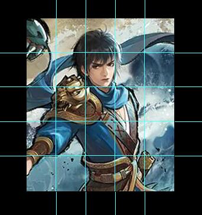

.. SPDX-License-Identifier: GFDL-1.3-or-later

Hello world! 创建扩展
=======================

扩展包的内容
-------------

如在上一章所述，新月杀的游戏扩展文件全部位于packages文件夹。\
我们先看看游戏中现有的扩展是怎样的。打开packages/shzl（神话再临）：

.. figure:: pic/1-1.jpg
   :align: center

   拓展包shzl的内部文件

1. init.lua

  init.lua文件是扩展包的核心，严格意义上，扩展包只会加载init.lua，\
  所以扩展中其他所有的lua文件都需要通过init.lua来加载。打开shzl的init.lua：

  .. code-block:: lua
   :linenos:

      local wind = require "packages/shzl/wind"
      local fire = require "packages/shzl/fire"
      local forest = require "packages/shzl/forest"
      local mountain = require "packages/shzl/mountain"
      local shadow = require "packages/shzl/shadow"
      local thunder = require "packages/shzl/thunder"
      local god = require "packages/shzl/god"

      return {
        wind,
        fire,
        forest,
        mountain,
        shadow,
        thunder,
        god,
      }

  我们可以看到通过\ ``require``\ ，对应目录下的wind风、fire火等子扩展包都加载进来了。\
  同理，也可以像标准包一样\ ``require``\ 要用的翻译文件、辅助函数。\
  总而言之，只有通过\ ``require``\ 才能加载init以外的lua。

  我们简单地解析一下这几行代码的作用，以第1行为例：

  .. code-block:: lua
   :linenos:

      local wind = require "packages/shzl/wind"

  这行代码的意思是“定义一个局部变量——\ **wind**\ ，然后将\ ``require``\ 的值赋给\ **wind**\ ”，

  * \ **wind**\ 前面的\ ``local``\ 代表的就是它是 **局部变量** ，没有了\ ``local``\ ，它就是 **全局变量** 。
    全局变量和局部变量都是 **变量** 。变量在使用前，需要在代码中进行 **声明** ，即创建该变量；在lua里面， ``local a``，就是创建了一个局部变量 ``a``。
    变量可以被访问，我们可以拿他来参与运算，也可以再赋值。
    一般而言，要 **慎用全局变量** ，因为它们很容易相互打架，造成污染。全局变量会被编辑器标为红色。

  * \ ``=``\ 便是编程中最常见的 **赋值** 符号，代表将右边的东西赋给左边。（可不是相等的意思，相等是 ``==`` ）\
    在lua里面， ``local a = 5`` ，就是创建了一个局部变量 ``a`` 并用 ``5`` 为其赋值。

  * \ ``require``\ 则是本行代码最重要的部分，它返回之后紧跟着的双引号内的lua文件所代表的全部东西，什么都有。
    下面几行都是相同的道理，分别载入了风火林山阴雷神7个子扩展包，每个文件都有各个子扩展包的武将，例如曹仁、张角就在\ **packages/shzl/wind.lua**\ 文件里面。

  * init.lua或者别的lua的最后都会有一个\ ``return``\  ，意思是返回整个模块，代表对整个文档的总结。
    这里返回了我们在上方定义的所有引用，并用\ ``{}``\ 包成了一个整体。
    第10行的 ``wind`` 就指向第1行声明过了的 ``wind`` 。局部变量在声明完毕之后，引用的时候就不用 ``local`` 啦（不然就变成再创建一个局部变量了）。

  每个扩展包lua都需要\ ``return``\ 一个扩展包，否则这个扩展包就是不存在的。

  .. hint::

    ``require`` 会将全局变量也加载进来，因此代码中要慎用全局变量。

  .. hint::

    当然也可以在init.lua塞进扩展包全部的内容，standard标准包就是这样的。理论上这也可以，但是还是分开比较好，尤其是有下文所述限制的前提下。

2. 子扩展包

   一个大的扩展包系列会含有多个小扩展包，例如神话再临的风林火山，\
   一将成名的2011~……等。子扩展包是游戏中武将一览的划分区间。\
   这样做既是为了分类美观、查找方便，也是限制单个lua文件大小。

   .. hint::

     Lua语言规定单个文件至多只能有200个局部变量，\
     因此根据估算，我们建议一个子扩展包的武将数量不要超过40。

3. audio、image

   顾名思义是存放扩展包语音、图片的文件夹。对于我们的第一个扩展做得简单些，\
   只需要了解：audio中的death为武将阵亡语音，skill为技能语音；\
   image中的general为武将图片。

4. 其他文件

   包括开源声明、git托管文件等，先不管它们。

创建拓展包
-----------

我们模仿shzl的形式创建一个扩展。首先在packages文件夹下建立一个新文件夹。\
老传统，我们的第一个扩展就叫study学习包~

   新建文件夹

然后在study文件夹中创建一个init.lua文件。可以直接从其他包复制，\
也可以新建一个txt文本然后改名。用VSCode打开它，修改代码加载子扩展包：

   新建文本文件并改名

.. code-block:: lua
   :linenos:

   local xuexi = require "packages/study/xuexi"

   return {
     xuexi,
   }

.. hint::

   1. 我们在代码中利用到的标点都是半角符号，也就是英文输入模式下的标点。比如第1行里的引号不是 ``“”`` 而是 ``""``，第4行的逗号不是 ``，`` 而是 ``,``。（当然，通过设置输入法，我们也可以在中文输入模式下打出半角符号~）
   2. 注意第4行开头的缩进。由于这一行属于下一个层级，我们需要往后缩进，让代码的结构更加清晰。在新月杀里，我们约定缩进2个空格。
   3. 以UTF-8无BOM格式编码。
   4. 所有文件尾必须留一个换行符，敲一个回车即可。（在这里的代码片段中，可能无法看到最后的空行，看示例代码更为清楚）

.. important::

   我们现在所做的一切操作结果都可以在 **引用示例.zip** 中找到，可以多多参考对照。

再在study文件夹下面建立一个新的xuexi.lua，修改为：

.. code-block:: lua
   :linenos:

   local extension = Package:new("xuexi")
   extension.extensionName = "study"

   Fk:loadTranslationTable{
     ["xuexi"] = "学习",
   }

   return extension
   

- 1行，声明以创建局部变量 ``extension``，将其赋值为创建出的名为 ``xuexi`` 的扩展包。这里的名字是子扩展包的名字。
  接下来的代码中， ``extension`` 就将代表整个子扩展包。

- 2行为这个子扩展包，也就是 ``extension`` ，指定 ``extensionName`` ，也就是它所属的大扩展包，其名字必须为我们文件夹的名字，
  整个大扩展包都是根据这个名字寻找路径的，包括lua，包括图片，所以不要填错。

- 4~6行是翻译表，这样在游戏中子扩展包的名字“xuexi”就会翻译为“学习”。

- 8行返回扩展包，这样程序就知道我们这个子扩展包的代码到这里就结束啦。

这样我们的扩展包就创建完成了！~之后我们的代码操作都会在这个 **xuexi.lua** 文件之内，别跑到 *init.lua* 去啦。

   创建好的扩展文件和子扩展文件

**保存** 好所有动过的文件。用 **单机启动** 打开游戏，查看武将一览，可以看到已经出现我们的学习包了，不过现在还是空的没有武将。

.. figure:: pic/1-5.jpg
   :align: center

   学习包！

.. attention:: 

   新的文件、修改过的代码文件都需要在 **保存** 之后 **重新打开游戏** 才能生效。我们开发新月杀一般都是在 **单机启动** 环境下进行的。

创建武将
---------

创建武将前先要想好武将的名字。我们先看看其他扩展包是怎么声明武将的：

.. code-block:: lua

   -- 标曹操 来自packages/standard/init.lua
   local caocao = General:new(extension, "caocao", "wei", 4)

   -- 界曹操 来自packages/standard_ex/init.lua
   local caocao = General(extension, "ex__caocao", "wei", 4)

其中标曹操的 ``General:new(...)`` 和界曹操的 ``General(...)`` 是等价的，
游戏会为我们自动生成一个新的武将对象，然后赋值给 ``=`` 前面的局部变量 ``caocao`` 。

这两个代码还是太简略了，把鼠标移到 ``General`` 函数上：

   插件可以为我们显示许多提示

插件已经提示一个General对象有哪些属性了。往下滚动，还能看到大佬写的注释！

   当然了，也能显示注释

根据注释，为武将创建“身份证”。我们的第一个武将就选三国第一人曹操吧！
在第8行插入一行，开始创建我们的曹操~

.. important::

   要注意把 ``return extension`` 留在文档末尾，以下我们的操作都要在这一行 ``return extension`` 之前完成！

.. code-block:: lua
   :emphasize-lines: 8
   :linenos:

   local extension = Package:new("xuexi")
   extension.extensionName = "study"

   Fk:loadTranslationTable{
     ["xuexi"] = "学习",
   }

   local caocao = General:new(extension, "st__caocao", "wei", 4, 6, General.Male)

   return extension
   

在 ``=`` 左边我们创建了一个局部变量 ``caocao`` ，在 ``=`` 右边我们创建了一个武将对象，\
通过 ``=`` 将其赋给了 ``caocao`` 。 ``caocao`` 是作为这段代码里的变量名而存在的，\
这个变量究竟命名成什么具有任意性，写成 ``WeiWu`` 、 ``a1man2`` 、 ``sousou``，只要在下文统一，\
都没有什么关系，看得顺眼取名就是了。

``=`` 右边我们创建的武将对象中参数的含义分别是：

1. ``extension`` : 我们之前创建扩展包时声明过的，表示这个曹操属于 ``xuexi`` 包。

2. ``st__caocao`` : 在新月杀中，一个武将拥有 ``trueName`` 和 ``name`` 两个属性，
   这里写的是武将的 ``name`` ；而 ``trueName`` 则为下划线后的部分 ``caocao`` ，\
   毕竟武将是可以重名的嘛，我们还有标曹操 ``caocao`` 、界曹操 ``ex__caocao`` 、\
   江山如故的if曹操 ``js__caocao`` 、海外服的令法曹操 ``os_sp__caocao`` 。\
   神曹操他比较特殊，我们不把他当作曹操的同分异构体，因此他的truename是 ``godcaocao`` ，\
   和我们的 ``caocao`` 不同。在新月杀中，同名武将替换功能
   就是判断武将的 ``trueName`` 是否相同来实现的。

   ``name`` 是武将身份证号，那必然不能和他人重复，因此我们加上 ``st__`` 前缀。\
   游戏会自动判断武将 ``trueName`` 前双下划线前面的部分，也就是 ``st`` ，\
   并把它翻译出来，显示在武将一览界面武将图片的右下角。例如， ``ex`` 的翻译为“界” 。\
   给 ``st`` 加一行翻译，就补在子扩展包名字翻译的下面吧：

   .. code-block:: lua
      :lineno-start: 4
      :emphasize-lines: 3

      Fk:loadTranslationTable{
        ["xuexi"] = "学习",
        ["st"] = "学",
      }

   这样我们的学曹操在游戏中就会在图片右下角显示带框的“学”标志，\
   并且可以在开局武将替换时和标曹操、界曹操等同名替换。

   再为曹操的名字添加翻译，这个就加在 ``local caocao = ...`` 的后面去吧：

   .. code-block:: lua
      :lineno-start: 9
      :emphasize-lines: 3-5

      local caocao = General:new(extension, "st__caocao", "wei", 4, 6, General.Male)

      Fk:loadTranslationTable{
        ["st__caocao"] = "曹操",
      }

   .. hint:: 

      其实这就是为翻译表添加一条：碰到 ``st__caocao`` 要翻译成 ``曹操``，所以不必和4-7行合并，\
      为了代码整体看起来更有条理，我们就将与曹操有关的翻译放在曹操的后面，后面可以再创建武将张三，再加张三的翻译等等。

      游戏加载武将时会根据 ``name`` 自动计算出 ``trueName`` ，我们只需写好 ``name`` 就可以了。

3. ``wei``：武将的势力

   新月杀标准版中有wei魏、shu蜀、wu吴、qun群四个势力，直接填字符串即可。\
   而新月杀创建新势力非常简单，不需要修改任何文件，填字符串，\
   再加几张图片保证美术效果就行了，可以参照ol扩展jin晋势力。

4. ``4``：武将的初始体力值

5. ``6``：武将的初始体力上限，默认为和初始体力值相等（ **默认**：如果我们不填，程序会自动取默认值）

6. ``General.Male``：武将的性别（默认为 ``General.Male`` ）

   ``General.Male`` 为男性， ``General.Female`` 为女性，由于三国杀大部分武将为男性，新月杀武将性别的默认值为男性。\
   另外还有双性别（海外服的牛辅董翓就是双性别）以及无性别（国战的暗将是无性别的）\
   以及武装直升机等96种性别（雾）

   .. hint:: 
      在lua中，赋值是从左到右依次代入的，
      所以你如果要指定性别的话就必须把前面的参数填了。
      例如你想整4血女将就必须写成 ``General:new(extension, "youmu"（你的女将名字）, "qun"（势力）, 4, 4, General.Female)`` 

7. 一些其他的属性

   还有不通过初始化声明的属性，我们也加上

   ``subkingdom`` : 武将的“副国籍”，这是手杀中的一个概念，\
   游戏开始时可以在主势力和副势力中选择一个，和神武将开局选势力类似。\
   曹操作为汉末群雄，那就加个群势力吧！

   .. code-block:: lua
      :lineno-start: 9
      :emphasize-lines: 2

      local caocao = General:new(extension, "st__caocao", "wei", 4, 6, General.Male)
      caocao.subkingdom = "qun"

   我们之前已经声明过 ``caocao`` 这个对象了，因此用 ``.subkingdom`` 给他增加一条“属性”。

   ``shield`` : 武将的初始护甲，这也是手杀出的新答辩概念。
   直接一行 ``caocao.shield = 2`` 为曹老板加2点护甲！（华雄：我tm）

   ``hidden`` 、 ``total_hidden`` : 武将的可见性。 ``hidden`` 表示这个武将不能\
   通过选将的方式选到他，但还是可以点将的，各种活动boss如虎牢关吕布就应该是这种。
   ``total_hidden`` 则是连武将图鉴都看不到他了，点将也不能选择，\
   可能只能作为彩蛋吧~我们的学曹操不需要这个，不管它。

   .. hint:: 

      打开lua/core/general.lua文件，能看到 ``General`` 对象的定义和更详细的注释。

弄得差不多了，来看看我们的成果：

.. code-block:: lua
   :linenos:

   local extension = Package:new("xuexi")
   extension.extensionName = "study"

   Fk:loadTranslationTable{
     ["xuexi"] = "学习",
     ["st"] = "学",
   }

   local caocao = General(extension, "st__caocao", "wei", 4, 6, General.Male)
   caocao.subkingdom = "qun"
   caocao.shield = 2

   Fk:loadTranslationTable{
     ["st__caocao"] = "曹操",
   }

现在保存文件，重新打开游戏，我们可以在武将一览“学习”里面找到我们的曹操啦：

   貂老板……

新月杀中，如果没有插画，武将就会显示成貂蝉的剪影。下面，我们就要给曹操补上插画！

添加武将图片
-------------

新月杀的武将图片很简单，只用一张图片即可显示游戏中武将的插画和主界面的头像。\
*其实是为了压缩游戏的体积*

将图片裁剪为250×292像素，用五等分线让武将的脸显示在(3,2)这个格内，\
就有比较好的效果了。当然也可以省事，选一张你认为游戏内美观的武将，\
简单叠一下即可。我们选一张官盗的青年曹操插画~

   在PS中借助五等分线裁剪武将图片

存储为jpg格式，压缩质量选75%（将大小保持在30KB以下），重命名为“st__caocao”（也就是武将的 ``name`` ），\
放在扩展包文件的/image/generals文件夹。

   放到正确的文件夹下

再打开游戏：

.. figure:: pic/1-11.jpg
   :align: center

   卡图效果

   小头像效果

效果不错！这样武将就创建好啦！

  .. hint:: 
    
    为了美观，我们可以单独指定双将的形象和头像，\
    单独截图后置于 ``generals`` 文件夹内的 ``dual`` / ``avatar`` 文件夹即可（没有就新建一个），\
    可以参考shzl的颜良文丑。

    其中，双将形象的规格为 ``124x292`` ，而头像的规格为 ``134x134`` 。
