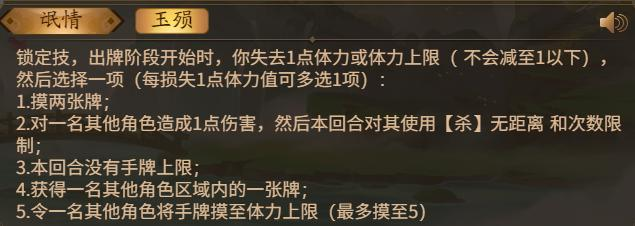
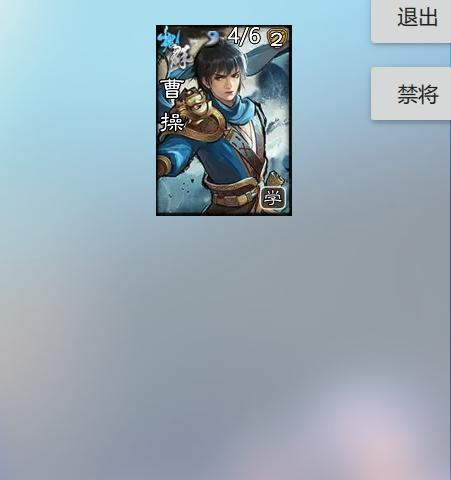
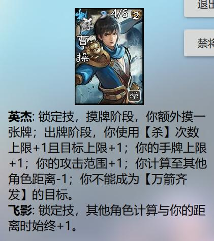
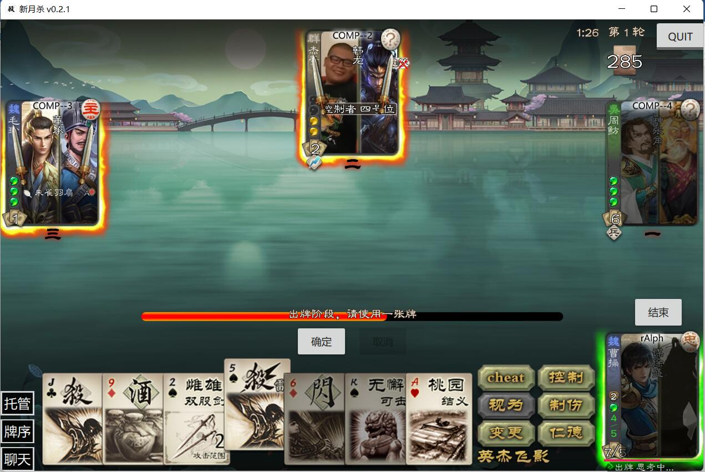
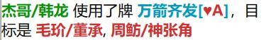

.. SPDX-License-Identifier: GFDL-1.3-or-later

创建第一个技能
===============

新月杀的技能类别
----------------

在编写技能前，我们先简单了解一下新月杀中技能有哪些类别。这里的技能类别指的不是\
“锁定技”、“限定技”等三国杀游戏中的技能标签，而是指新月杀中技能的作用方式。\
举个例子，〖无双〗、〖马术〗、〖奇才〗、〖狂骨（旧）〗、〖红颜〗，\
这些技能的标签都是“锁定技”，但他们的生效方式大不相同。\
〖无双〗和〖狂骨〗是在满足一定时机条件后才会发动，它们的表现方式是不可拒绝、\
必须发动技能，除此以外和〖遗计〗、〖闭月〗这些非锁定技没有太大区别；\
而〖马术〗、〖奇才〗、〖红颜〗则像是为角色赋予了一种“属性”，\
拥有这个技能的角色好像可以违反规则，对距离不够的角色出牌，甚至改变牌的信息。

在新月杀中，根据这两类技能的作用方式，可以分为以下两大技能类别：

.. glossary::

    可使用类技能（UsableSkill）
      有一定发动时机的技能，需要由角色发动（有的可选发动，有的必须发动）来产生影响。例如〖制衡〗、〖无双〗等。

    状态类技能（StatusSkill）
      没有发动时机的技能，不需要角色发动就能产生影响。例如〖马术〗、〖红颜〗等。

1. :term:`可使用类技能<可使用类技能（UsableSkill）>` （ ``UsableSkill`` ）包括：

.. glossary::

    触发技（TriggerSkill）
      在满足一定时机条件时发挥效果的技能，这类技能在技能描述中都会带有“当……时/前/后”，\
      如〖遗计〗、〖无双〗。触发技是三国杀中最广泛，也是最复杂的一类技能。

    主动技（ActiveSkill）
      玩家主动发动的技能，通常描述为“出牌阶段，你可以…”，如〖仁德〗、〖制衡〗。\
      这类技能通常是需要点击一下按钮，然后选择若干符合条件的牌和角色，再点确定发动。

    视为技（ViewAsSkill）
      将一张牌当做另一张牌的技能，通常描述为“你可以将…当…使用/打出”、“视为使用…”，\
      也就是我们常说的转化技，如〖武圣〗、〖倾国〗。它们和主动技的区别在于，\
      虽然也是选择牌和角色再点确定，但是转化技试图执行的是转化后的游戏牌的效果，\
      而其选择目标的操作也由此游戏牌规定。之后的例子中我们会看到这种区别。

2. :term:`状态类技能<状态类技能（StatusSkill）>` （ ``StatusSkill`` ），包括：

.. glossary::

    距离技（DistanceSkill）
      影响距离计算的技能，如〖马术〗、〖飞影〗。

    攻击范围技（AttackRangeSkill）
      影响攻击范围计算的技能，如 :abbr:`〖弓骑〗的效果 (……你本回合的攻击范围无限)`。

    手牌上限技（MaxCardsSkill）
      影响手牌上限计算的技能，如〖血裔〗。

    禁止技（ProhibitSkill）
      禁止卡牌的技能，如〖谦逊〗、 :abbr:`〖鸡肋〗的效果 (……本回合伤害来源不能使用、打出或弃置你声明的此类手牌。)`。

    卡牌增益技（TargetModSkill）
      增强卡牌使用的技能，有次数上限、目标上限、距离限制等等的效果，如〖咆哮〗、〖奇才〗。

    锁定视为技（FilterSkill）
      让一张牌视为另一张牌的技能，如〖红颜〗、〖武神〗。

.. hint::

  具体而准确的各类技能定义请查看lua/core/skill.lua
  和lua/core/skill_type下的所有文件。

三国杀发展到今天，很难有纯粹的单一类别的技能了，\
因此三国杀中的一个技能通常是拆出多个部分来实现的。我们挑一个复杂技能来分析它们要用什么类别的技能实现：

   来分析一下官方武将的技能！

“锁定技”，说明技能的标签是“锁定技”，这个我们后面再讲；

“出牌阶段开始时，执行一些操作”，技能主体是一个 :term:`触发技<触发技（TriggerSkill）>` ；

.. hint::

  “\ **出牌阶段（限X次）**\ ，执行一些操作”是 :term:`主动技<主动技（ActiveSkill）>` 。

  “出牌阶段开始时”、“出牌阶段结束时”都是单独的时机，到了这个时机游戏程序（或者说裁判）就会询问是否发动某某技能，所以是 :term:`触发技<触发技（TriggerSkill）>` ；\
  “出牌阶段，……”的时机是“出牌阶段内的空闲时间点”，也就是出牌阶段里面可以思考出牌、\
  可以点击结束出牌阶段的那个时机，这个时候可没有谁来询问我们是否发动〖仁德〗、〖制衡〗，所以是 :term:`主动技<主动技（ActiveSkill）>` 。

  而 :term:`视为技<视为技（ViewAsSkill）>` ，因为本质是使用/打出一张牌，而这需要你主动完成，所以某种意义上它也是 :term:`主动技<主动技（ActiveSkill）>` 。

.. hint::

  “选择一名……/获得某角色一张……/令某角色……”，是一种询问，是会要求进行的操作（也就是……烧条）。

“使用某牌无距离（次数）限制”，是 :term:`卡牌增益技<卡牌增益技（TargetModSkill）>` ；

“本回合手牌上限”，显然是个 :term:`手牌上限技<手牌上限技（MaxCardsSkill）>` 。

由于这种复合技能的普遍存在，编写者必须要了解三国杀的结算规则体系，\
还要能透过各种不准确的描述分析“设计本意”（编写者最讨厌的东西），\
或者参考网杀的结算。在编写技能前对技能进行分析拆分，这样才能准确、高效地实现技能效果。

一个复杂技能！（初级）
-----------------------

通过拆分，可以用多个小技能实现一个较为复杂的大技能。通常来说，\
状态技是比使用技容易实现的，我们先来实现一个（看似）复杂的技能，\
然后把它添加给之前的学习包曹操。

    英杰：锁定技，摸牌阶段，你额外摸一张牌；出牌阶段，
    你使用【杀】次数上限+1且目标上限+1；你的手牌上限+1；你的攻击范围+1；
    你计算至其他角色距离-1；你不能成为【万箭齐发】的目标。

（曹操：我当世英杰，什么都会很正常吧！）

（周瑜、袁绍：？）

先拆分一下技能。除了多摸一张牌是触发技，其他的【杀】增益、手牌上限、\
攻击范围、距离、禁止技全都是状态技，只是看起来复杂而已。

可是我们还没有教过怎么做技能啊！如之奈何！

别担心，这就传授大家一个秘籍：天下代码一大抄！

1. 首先是 **锁定技，摸牌阶段，你额外摸一张牌** ，我们马上想到界周瑜的技能〖:abbr:`界英姿 (锁定技，摸牌阶段，你多摸一张牌；你的手牌上限等于你的体力上限。)`〗，
   打开 :file:`standard_ex` （标准界限突破）文件夹的init.lua文件。
   可以从VSCode资源管理器快速打开，不用退出重开！

   .. figure:: pic/2-2.jpg
      :align: center

      在vscode中直接打开其他拓展包

   然后按Ctrl+F，在文件中搜索yingzi，编辑器立刻跳转到包含yingzi的第一行：

   .. code-block:: lua
      :linenos:

      local ex__yingzi = fk.CreateTriggerSkill{
        name = "ex__yingzi",
        anim_type = "drawcard",
        frequency = Skill.Compulsory,
        events = {fk.DrawNCards},
        on_use = function(self, event, target, player, data)
          data.n = data.n + 1
        end,
      }
      local ex__yingzi_maxcards = fk.CreateMaxCardsSkill{
        name = "#ex__yingzi_maxcards",
        fixed_func = function(self, player)
          if player:hasSkill(self.name) then
            return player.maxHp
          end
        end
      }

   我们分析一下界英姿，它包含两个技能： ``ex__yingzi`` 和 ``ex__yingzi_maxcards`` ，\
   第一行是用 ``fk.CreateTriggerSkill`` 创建了一个触发技。所有的技能都是使用 ``fk.CreateXXXSkill`` 创建的。\
   从命名和技能函数名可以猜到， ``ex__yingzi`` 是摸一张牌的 :term:`触发技<触发技（TriggerSkill）>` ，\
   而 ``ex__yingzi_maxcards`` 是 :term:`手牌上限技<手牌上限技（MaxCardsSkill）>` 。我们需要的是这个摸一张牌技能，\
   所以把第一段复制粘贴到学习包：

   .. code-block:: lua
    :linenos:
    :lineno-start: 9
    :emphasize-lines: 5-13

      local caocao = General(extension, "st__caocao", "wei", 4, 6, General.Male)
      caocao.subkingdom = "qun"
      caocao.shield = 2

      local ex__yingzi = fk.CreateTriggerSkill{
        name = "ex__yingzi",
        anim_type = "drawcard",
        frequency = Skill.Compulsory,
        events = {fk.DrawNCards},
        on_use = function(self, event, target, player, data)
          data.n = data.n + 1
        end,
      }
          
      Fk:loadTranslationTable{
        ["st__caocao"] = "曹操",
      }

   了解一下这些代码是什么意思：

   - 13行：声明了一个触发技， ``ex__yingzi`` 是这个技能对象的变量名。\
     我们把它改成 ``st__yingjie`` 。

   - 14行：为技能名赋值 ``"ex__yingzi"`` 。和武将类似，技能的 ``name`` 是技能的唯一“代号”，\
     整个游戏所有技能都不允许 ``name`` 重复，所以要把它改掉，也改成 ``"st__yingjie"`` 。\
     虽然这里的前缀不会像武将名那样自动翻译，但却是一个很好的区分 ``name`` 标志，\
     这样基本能保证不会和其他技能撞名字。

   - 15行：技能动画类型。在发动技能时，自动播放 ``"drawcard"`` 动画，\
     这是OL和十周年的动画效果。在 /image/anim/skillinvoke 中可以看到所有类型动画的文件，\
     改成想要的动画效果文件名即可。

     .. figure:: pic/2-3.jpg
        :align: center

        动画效果演示

   - 16行：触发技的“频率”。目前有锁定技 ``Skill.Compulsory`` 、
     限定技 ``Skill.Limited`` 、觉醒技 ``Skill.Wake`` 等需要使用。

   - 17行：触发技的时机， ``fk.DrawNCards`` 代表摸牌阶段摸牌时。

   - 18~20行：触发技的效果，为摸牌阶段摸牌数的数据+1即可。

   .. hint::

      触发技是游戏中最复杂也是数量最多的技能，之后再深入讨论。

   这样摸一张牌的效果就做好啦！

2. **出牌阶段，你使用【杀】次数上限+1且目标上限+1。** 这个效果是太史慈的〖天义〗！

   找到shzl/fire中的〖天义〗，发现它由三部分组成：一个 ``tianyi`` 本体是主动发起拼点；\
   一个 ``tianyi_targetmod`` 的拼点赢后使用杀增益效果，还有一个 ``tianyi_prohibit`` \
   是拼点没赢后禁止使用杀的效果。我们把增益技能 ``tianyi_targetmod`` 搬过来，\
   粘贴在之前的 ``st__yingjie`` 后面：

   .. code-block:: lua
    :linenos:
    :lineno-start: 13

      local st__yingjie = fk.CreateTriggerSkill{
        name = "st__yingjie",
        anim_type = "drawcard",
        frequency = Skill.Compulsory,
        events = {fk.DrawNCards},
        on_use = function(self, event, target, player, data)
          data.n = data.n + 1
        end,
      }
      local tianyi_targetmod = fk.CreateTargetModSkill{
        name = "#tianyi_targetmod",
        residue_func = function(self, player, skill, scope)
          if skill.trueName == "slash_skill" and player:getMark("tianyi_win-turn") > 0 and scope == Player.HistoryPhase then
            return 1
          end
        end,
        distance_limit_func =  function(self, player, skill)
          if skill.trueName == "slash_skill" and player:getMark("tianyi_win-turn") > 0 then
            return 999
          end
        end,
        extra_target_func = function(self, player, skill)
          if skill.trueName == "slash_skill" and player:getMark("tianyi_win-turn") > 0 then
            return 1
          end
        end,
      }

   22行声明技能，就不重复讲啦。改成 ``st__yingjie_targetmod``

   23行为技能名赋值。我们之前已经将主技能摸一张牌命名为 ``"st__yingjie"`` 了，\
   所以这个技能不能重名。然后注意到复制过来的这个天义，它的 ``name`` 首字符是“#”，\
   加入到游戏中就不会显示技能按钮，之后我们将这个技能和另外的技能合并组成一个技能的情况下\
   只会显示一个〖天义〗按钮。我们这里改成 ``"#st__yingjie_targetmod"`` 。

   24~28行、29~33行、34~38行，根据命名可以看出分别为增益牌的\
   使用次数、距离、额外目标。把鼠标移到函数名上可以看到注释，以24行为例：

   这里提示 ``residue_func`` （增减使用【杀】的上限技能） 的参数分别为 ``self`` （技能本身）， ``player`` （角色）、\
   ``skill`` （想要增益的技能）， ``scope`` （作用的时间范围）， ``card`` （想要增益的牌），\
   ``to`` （对目标有何限制）。同理， ``distance_limit_func`` 和\
   ``extra_target_func`` 函数也可以看到各自的参数。注意， ``residue_func`` 比后面的多一个  ``scope`` 参数。

   天义的的上限增益条件是：如果（ ``if`` ）增益的技能是【杀】的技能（ ``skill.trueName == "slash_skill"`` ），\
   并且（ ``and`` ）角色有“天义赢、一回合有效”的标记（ ``player:getMark("tianyi_win-turn") > 0`` ，这个标记是拼点赢后得到的）\
   次数增益的时间范围为某个阶段（ ``scope == Player.HistoryPhase`` ，假如我们有两个出牌阶段，每个出牌阶段使用【杀】次数上限都+1），

   那么（ ``then`` ）这个技能返回的结果（ ``return`` ）是1或者999（次数+1；攻击范围无限，我们一般用999，不会有1000个人玩游戏吧；目标+1。\
   这里的技能效果都是把结果数字加上去）。

   .. note::

      注意 ``.`` 和 ``:`` 的不同。
      ``A.B`` ， ``B`` 是 ``A`` 的一个属性，例如 ``skill.trueName`` ， ``trueName`` 是 ``skill`` 的一个属性，好比“年龄”是一个人的属性。
      ``A:C(...)``， ``C`` 是 ``A`` 的一个方法，例如 ``player:getMark(...)`` ， ``getMark`` （获取其标记）是 ``player`` 的一个方法，好比“说话”的一个人的行为。
      注意 ``:C`` 后面一定有括号 ``()`` ，括号里的是参数。有的方法可能没有参数，有的可能有很多个参数。

   想一想我们曹操的技能，它的增益条件很简单：增益的技能是【杀】的技能（和太史慈的 ``skill.trueName == "slash_skill"`` 一样），\
   并且只要角色拥有这个技能（ ``player:hasSkill(self.name)`` ），那么就能受到次数和目标数的增益；使用杀次数增益的时间范围为某个阶段。

   修改一下，就成了我们的技能了~

   .. hint::

      一般来说，牌的使用次数限制一般会查询本阶段使用牌的次数，这个后文再讲。

   .. code-block:: lua
    :linenos:
    :lineno-start: 22

      local st__yingjie_targetmod = fk.CreateTargetModSkill{
        name = "#st__yingjie_targetmod",
        residue_func = function(self, player, skill, scope)
          if skill.trueName == "slash_skill" and player:hasSkill(self.name) and scope == Player.HistoryPhase then
            return 1
          end
        end,
        extra_target_func = function(self, player, skill)
          if skill.trueName == "slash_skill" and player:hasSkill(self.name) then
            return 1
          end
        end,
      }

   .. hint::

      targetModSkill的技能原型在core/skill_type/target_mod.lua

3. **你的手牌上限+1** ，想到一个增加手牌上限数的技能：
   一将成名2012刘表的〖宗室〗，复制宗室并修改参数：

   .. code-block:: lua
      :linenos:
      :lineno-start: 35

      local st__yingjie_maxcards = fk.CreateMaxCardsSkill{
        name = "#st__yingjie_maxcards",
        correct_func = function(self, player)
          if player:hasSkill(self.name) then
            return 1
          else
            return 0
          end
        end,
      }

   手牌上限技的参数很简单，只有 ``self`` （技能本身）和 ``player`` （角色），\
   返回值为增加手牌上限的数量，所以直接判断角色有这个技能就+1，否则+0就好啦。

4. **你的攻击范围+1**
   
5. **你计算至其他角色距离-1**
   
6. **你不能成为【万箭齐发】的目标**
   
   看了前面几个状态技，现在应该轻车熟路了！照抄〖弓骑〗、〖马术〗、〖谦逊〗即可。\
   攻击范围技、距离技、禁止技这三种状态技的主要参数都是
   ``from`` （起始角色）和 ``to`` （目标角色），代码如下：

   .. code-block:: lua
      :linenos:
      :lineno-start: 45

      local st__yingjie_attackrange = fk.CreateAttackRangeSkill{
        name = "#st__yingjie_attackrange",
        correct_func = function (self, from)
          if from:hasSkill(self.name) then
            return 1
          end
          return 0
        end,
      }
      local st__yingjie_distance = fk.CreateDistanceSkill{
        name = "#st__yingjie_distance",
        correct_func = function(self, from, to)
          if from:hasSkill(self.name) then
            return -1
          end
        end,
      }
      local st__yingjie_prohibit = fk.CreateProhibitSkill{
        name = "#st__yingjie_prohibit",
        is_prohibited = function(self, from, to, card)
          if to:hasSkill(self.name) then
            return card.name == "archery_attack"
          end
        end,
      }

   写出技能之后翻译成文字想一遍就通顺了：如果起始角色拥有本技能，\
   则攻击范围+1；如果起始角色拥有本技能，则到任何目标角色的距离-1；\
   如果目标角色拥有本技能，则当卡牌名为 *万箭齐发* 时不允许对他使用……

   .. hint::

      就像武将一样，卡牌的 ``name`` 和 ``trueName`` 不是同一个东西，
      例如【杀】和火【杀】的 ``trueName`` 都是 *slash* ，但是它们的 ``name`` 分别是 ``slash`` 和 ``fire__slash`` 。

   .. hint::

      卡牌的 ``name`` 或者 ``trueName`` 都不是它们的中文名，它们对应的翻译才是，
      可以通过搜索翻译名找到它们的真名。

为武将添加技能
--------------

我们成功写出了一个（看起来）很复杂的强力技能，
现在就保存文件，然后进游戏开打吧！
在此之前，看看武将一览：

   白板曹操= =

我那么一大串技能呢？？？

在新月杀中，写完技能是要添加给武将的，而我们只是写了代码，还没有添加！添加一行：

.. code-block:: lua
  :linenos:
  :lineno-start: 70

   caocao:addSkill(st__yingjie)

表示把第一个摸一张牌的触发技添加给了 ``caocao`` 。
还记得吗， ``caocao`` 是我们上一章中创建的武将对象，
``addSkill`` 就是给武将对象添加技能的方法。

接下来还要把后面一堆子技能和主技能作绑定，用主技能的 ``addRelatedSkill`` 方法，\
这样就形成了一个整体，在游戏面板上只有一个技能标志。

.. code-block:: lua
  :linenos:
  :lineno-start: 62
  :emphasize-lines: 9-13

  local st__yingjie_prohibit = fk.CreateProhibitSkill{
    name = "#st__yingjie_prohibit",
    is_prohibited = function(self, from, to, card)
      if to:hasSkill(self.name) then
        return card.name == "archery_attack"
      end
    end,
  }
  st__yingjie:addRelatedSkill(st__yingjie_targetmod)
  st__yingjie:addRelatedSkill(st__yingjie_maxcards)
  st__yingjie:addRelatedSkill(st__yingjie_attackrange)
  st__yingjie:addRelatedSkill(st__yingjie_distance)
  st__yingjie:addRelatedSkill(st__yingjie_prohibit)
  caocao:addSkill(st__yingjie)

检查一下有没有遗漏，发现 ``st__yingjie_prohibit`` 被编辑器标为灰色了，\
说明声明的变量没有被引用，把它也补上。

这样技能〖英杰〗就添加给学曹操啦！

曹老板只有一个技能太单调了，我们给他再加一个技能！
就加一个神曹操的〖飞影〗加强防御吧！

给武将添加已有技能也是 ``addSkill`` 方法，但括号内的参数不是技能对象，\
而是技能的 ``name`` 字符串，就像这样：

.. code-block:: lua

   caocao:addSkill("feiying")

.. hint::

  通过这种方式添加的技能会显示在其他技能的下方。

接下来还要添加技能翻译，不然到游戏中只会显示技能的 ``name`` 了。加到“曹操”翻译的下面吧~

.. code-block:: lua
  :linenos:
  :lineno-start: 77
  :emphasize-lines: 3-7

  Fk:loadTranslationTable{
    ["st__caocao"] = "曹操",
    ["st__yingjie"] = "英杰",
    [":st__yingjie"] = "锁定技，摸牌阶段，你额外摸一张牌；" ..
    "出牌阶段，你使用【杀】次数上限+1且目标上限+1；"..
    "你的手牌上限+1；你的攻击范围+1；你计算至其他角色距离-1；" ..
    "你不能成为【万箭齐发】的目标。",
  }

其中 ``:`` 加技能 ``name`` 会被游戏自动翻译为技能描述。我们的技能太长了，\
在编辑器中一行显示不下，所以换一下行，两点 ``..`` 是Lua中的字符串连接命令，\
会把前后的字符串合在一起。

保存，进游戏！

   不再是白板的曹操

技能效果的调试（初级）
----------------------

虽然武将和技能描述都成功显示了，但还无法确定我们技能的实际效果是不是\
就和预期的一样。在把代码上传到服务器之前，还需要多次测试，不然很可能会被玩家报bug！\

这里介绍一个常用的简易调试方法：双将测试。

搭配测试武将双将测试是开启自由选将功能和双将功能，搭配大名鼎鼎的 **谋徐盛** 一同测试！\
谋徐盛的技能可以控制电脑操作，把电脑变成任意武将，获得任何牌并〖仁德〗出去，十分方便。

.. hint::

   谋徐盛位于测试包，是新月杀自带武将。不点将的话不会出现在选将框中（也就是\ **hidden**\ 为\ *true*\ ）。

我们在4人身份局里用双将测试一下：

能多摸牌，成功地使用杀目标+1且攻击范围+1；

   关于多摸牌和增强杀的测试

发动〖cheat〗获得【万箭齐发】和【青釭剑】，〖仁德〗给正对面的电脑并控制它；\
〖控制〗电脑使用【万箭齐发】，果然不会成为目标。

   关于不能被【万箭齐发】的测试

操控电脑装上【青釭剑】，并不能杀到我们。这样就大功告成了！

.. hint::

   可以在对局中按D键，查看我们到其他角色的距离，再按D键以取消。（显示出的数字不能及时刷新哦）

添加语音
----------------------
我们现在还没加语音呢，玩三国杀没有角色语音怎么行？

前一章我们在 image 文件夹下添加了图片，现在我们要创建 **audio** 文件夹，存放我们的语音。\
我们介绍过，audio文件夹中的death文件夹为武将阵亡语音，skill则是技能语音。\
文件怎么命名呢？可以看看其他扩展包的组织方法。其实很简单， **skill** 文件夹下 jianxiong1.mp3、\
jianxiong2.mp3 就是〖奸雄〗的两条技能语音； **death** 文件夹下 caocao.mp3 就是曹操的阵亡语音。

来到我们学习包下面，在audio文件夹下创建skill和audio两个文件夹。手头没有合适的语音，\
我们就先借用标曹操的语音吧！把两条〖奸雄〗语音复制进skill文件夹，把其中的 ``jianxiong`` \
改成我们〖英杰〗的“name” ``st__yingjie`` ；把曹操阵亡语音复制进death文件夹，改成st__caocao.mp3，\
这样就我们的语音文件就配置完毕了。

如果用其他音频文件处理的话，要将mp3文件的码率设为128kbps，将大小控制在三四十KB以内，至多也要在60KB左右。

重新启动游戏，配音按钮有了，听一听，没啥问题。但是没有任何文字，白花花的一片。这就需要添加语音翻译，还是回到我们的 xuexi.lua，\
**技能语音** 的文本规则为 ``$`` + 技能的“name” + 序号， **阵亡语音** 是 ``~`` + 武将的“name”。如下所示

.. code-block:: lua
  :linenos:
  :lineno-start: 77
  :emphasize-lines: 9-11

  Fk:loadTranslationTable{
    ["st__caocao"] = "曹操",
    ["st__yingjie"] = "英杰",
    [":st__yingjie"] = "锁定技，摸牌阶段，你额外摸一张牌；" ..
    "出牌阶段，你使用【杀】次数上限+1且目标上限+1；"..
    "你的手牌上限+1；你的攻击范围+1；你计算至其他角色距离-1；" ..
    "你不能成为【万箭齐发】的目标。",

    ["$st__yingjie1"] = "宁教我负天下人，休教天下人负我！",
    ["$st__yingjie2"] = "吾好梦中杀人！",
    ["~st__caocao"] = "霸业未成！未成啊！",
  }

这样，我们的曹操有了〖英杰〗和阵亡的语音，武将一览里也看到文字了~
